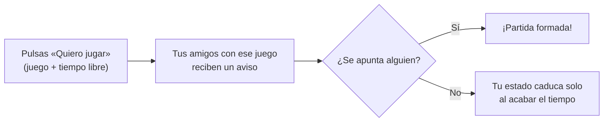

# 🎮 Partida Rápida

**Propietario - angelcarneros**
**Palabra del día -> 29**

**Entornos de Desarrollo (1.º DAM/DAW) – Tarea Módulo 2:** Reconocimiento de elementos en el desarrollo de un programa informático

> **¿Quién juega ahora?** Dices a qué te apetece jugar y ves al momento qué amigos se apuntan.

## Índice

1. [Selección de la aplicación](#1-selección-de-la-aplicación)
2. [Listado de características](#2-listado-de-características)
3. [Documentación inicial](#3-documentación-inicial)
4. [Análisis de requisitos](#4-análisis-de-requisitos)
5. [Entrega y presentación](#5-entrega-y-presentación)

---

## 1. Selección de la aplicación

### Qué es

**Partida Rápida** es una aplicación para organizar partidas online con amigos en el momento. El usuario pulsa «Quiero jugar», elige el juego y cuánto tiempo tiene libre, y los amigos que tienen ese juego reciben un aviso. De un vistazo se ve quién está disponible ahora mismo, sin tener que preguntar grupo por grupo.

### Por qué la he elegido

Es un problema que tengo yo y casi cualquiera que juegue online con amigos. Cuando te apetece jugar, escribes «¿alguien se echa una?» en varios grupos de WhatsApp o Discord; unos contestan tarde, otros no tienen el juego y, para cuando consigues organizarte, ya se te han quitado las ganas. Partida Rápida resuelve exactamente eso, así que es una idea sencilla de plantear pero con un objetivo muy claro.

### Justificación con conceptos vistos en clase

**Modelo de desarrollo ágil.** La función principal (avisar de que estás disponible y ver quién más lo está) es pequeña y se puede entregar en pocas semanas como primera versión usable. El resto de funciones, como las invitaciones, las notificaciones o los grupos, se añaden después en iteraciones cortas, ajustándolas a lo que pidan los usuarios. Se desarrolla en el apartado 3.

**Usuarios y roles bien definidos.** El usuario principal es el jugador: normalmente joven, acostumbrado a usar apps, pero sin ganas de configurar nada. Además hay dos roles secundarios, el creador de grupo y el administrador. Conocer bien al usuario condiciona los requisitos, sobre todo los de usabilidad.

**Plataformas.** La aplicación encaja de forma natural en el móvil, porque las notificaciones llegan al instante y el móvil siempre está a mano. Se completa con una versión web para consultarla desde el PC mientras se juega.

**Fases del ciclo de vida.** El proyecto pasa por todas las fases vistas: análisis, diseño, codificación, pruebas, documentación, explotación y mantenimiento. El mantenimiento tiene un peso especial, porque salen juegos nuevos constantemente y el catálogo tendrá que actualizarse durante toda la vida de la aplicación.

---

## 2. Listado de características

Un **requisito funcional (RF)** describe *qué hace* la aplicación: una acción o un servicio concreto que ofrece al usuario. Un **requisito no funcional (RNF)** describe *cómo* lo hace o con qué restricciones: rendimiento, seguridad, usabilidad, compatibilidad, etc. La última columna indica de qué tipo es cada característica.

| # | Característica | Tipo |
|:-:|---|---|
| 1 | Registro e inicio de sesión con correo o con una cuenta de Google o Apple | Funcional |
| 2 | Perfil de jugador con sus plataformas (PC, PlayStation, Xbox, Nintendo Switch o móvil) y los juegos que tiene | Funcional |
| 3 | Añadir amigos con un código o un enlace, y crear grupos (por ejemplo, «Los de clase») | Funcional |
| 4 | Botón «Quiero jugar»: eliges juego, plataforma y cuánto tiempo estás libre | Funcional |
| 5 | Lista de amigos disponibles ahora mismo, con filtro por juego y plataforma | Funcional |
| 6 | Invitar a uno o varios amigos, que responden con un toque: «Voy», «En 10 min» u «Hoy no» | Funcional |
| 7 | Aviso en el móvil cuando un amigo se pone disponible en un juego que tú también tienes | Funcional |
| 8 | Modo «No molestar» por horarios (clase, noche, exámenes) | Funcional |
| 9 | Bloquear y denunciar a otros usuarios | Funcional |
| 10 | El estado de los amigos se actualiza en tiempo real, en menos de 3 segundos | No funcional (rendimiento) |
| 11 | Avisar de que quieres jugar en 3 toques como máximo | No funcional (usabilidad) |
| 12 | Tu estado solo lo ven tus amigos y los datos se tratan según el RGPD | No funcional (seguridad y privacidad) |
| 13 | Funciona en Android, iOS y navegador web | No funcional (portabilidad) |
| 14 | Aguanta los picos de uso de las tardes y los fines de semana sin caerse | No funcional (escalabilidad) |
| 15 | Consume muy poca batería en segundo plano | No funcional (eficiencia) |

---

## 3. Documentación inicial

### Nombre

**Partida Rápida**

### Descripción breve

Partida Rápida es una aplicación móvil y web que muestra en tiempo real qué amigos están disponibles para jugar a un juego concreto y permite invitarlos con un toque. Funciona con cualquier plataforma de juego y no pretende sustituir a los chats de voz como Discord: se encarga solo del paso anterior, el de juntar a la gente.

El flujo principal de la aplicación es este:

### Objetivos (qué problema resuelve)

Hoy, para organizar una partida hay que preguntar en varios grupos de mensajería, esperar respuestas y averiguar quién tiene el juego y en qué plataforma. Es lento, la información se pierde entre otros mensajes y muchas veces la partida no llega a jugarse.

La aplicación tiene cuatro objetivos: reducir a menos de un minuto el tiempo que se tarda en juntar gente para jugar; reunir en un solo sitio la disponibilidad de todos los amigos, sea cual sea su plataforma; avisar solo a quien le interesa, es decir, a quien tiene el juego y no ha activado el modo «No molestar»; y evitar estados desactualizados, ya que la disponibilidad caduca sola al terminar el tiempo indicado.

### Usuarios principales (roles)

| Rol | Quién es | Qué puede hacer |
|---|---|---|
| **Jugador** | El usuario principal. Suele tener entre 14 y 30 años y está acostumbrado a usar apps, pero no quiere perder tiempo configurando nada. | Publicar su disponibilidad, ver qué amigos están disponibles, invitar y responder a invitaciones. |
| **Creador de grupo** | Un jugador que crea un grupo de amigos (por ejemplo, «Los de clase»). | Todo lo anterior y, además, añadir o quitar miembros del grupo y avisar a todo el grupo a la vez. |
| **Administrador** | Una persona del equipo que mantiene la aplicación. | Gestionar el catálogo de juegos, revisar las denuncias y suspender las cuentas que incumplan las normas. |

### Plataformas

| Plataforma | Papel | Motivo |
|---|---|---|
| Móvil (Android e iOS) | Principal | Las notificaciones llegan al instante y el móvil siempre está a mano, justo lo que necesita una aplicación pensada para jugar en el momento. |
| Web | Secundaria | Para consultarla desde el PC mientras se juega, sin tener que coger el móvil. |
| Escritorio | No se incluye en la primera versión | Duplicaría trabajo sin aportar mucho frente a la versión web. Podría añadirse más adelante si los usuarios la piden. |

Para no programar lo mismo varias veces, se usaría un framework multiplataforma como Flutter, que genera la app de Android, la de iOS y la versión web a partir del mismo código.

### Modelo de desarrollo sugerido: ágil (Scrum)

Propongo un modelo ágil, en concreto Scrum, con sprints de dos semanas. El primer motivo es que los requisitos no están cerrados: hasta que la gente no use la aplicación no sabremos, por ejemplo, si prefiere un aviso por cada amigo o un resumen, y un modelo ágil permite cambiar de rumbo sin rehacerlo todo. El segundo es que la función principal es pequeña y se puede entregar muy pronto como producto mínimo viable (MVP), así que los usuarios pueden probarla desde el primer mes. El tercero es que al final de cada sprint se enseña lo hecho a usuarios reales (por ejemplo, compañeros de clase que hagan de probadores), y su opinión decide qué se hace en el siguiente.

Los requisitos del apartado 4 formarían la pila del producto (*product backlog*), y el reparto en sprints sería este:

| Sprint | Qué se entrega |
|:-:|---|
| 1 | Registro, inicio de sesión, perfil y amigos |
| 2 | Botón «Quiero jugar» y lista de amigos disponibles (primera versión usable o MVP) |
| 3 | Invitaciones y notificaciones |
| 4 | Grupos, modo «No molestar», bloqueo y denuncias |
| 5 | Panel de administración y mejoras de rendimiento a partir de lo aprendido en los sprints anteriores |

En cada sprint se recorren, en pequeño, las fases del ciclo de vida: se analizan los requisitos de ese sprint, se diseñan, se codifican, se prueban y se entregan. Así los errores se detectan pronto, en lugar de aparecer al final del proyecto.

**Por qué no en cascada.** Este modelo exige tener todos los requisitos cerrados desde el principio, y el usuario no ve nada hasta el final. Si la función estrella no convenciera, nos enteraríamos cuando ya estuviera todo hecho.

**Por qué no en espiral.** Está pensado para proyectos grandes y con mucho riesgo, en los que compensa hacer un análisis de riesgos formal en cada vuelta. Para una aplicación de este tamaño sería un proceso demasiado pesado.

---

## 4. Análisis de requisitos

Cada requisito lleva un código (RF-XX o RNF-XX) para poder referenciarlo en el resto del proyecto, por ejemplo al planificar los sprints o al diseñar las pruebas.

### Requisitos funcionales

#### RF-01 · Registro e inicio de sesión

La aplicación permitirá crear una cuenta con correo y contraseña, o con una cuenta de Google o Apple, e iniciar y cerrar sesión.

*Por qué es importante:* es la base de todo lo demás. Sin identificar a cada usuario no se puede saber quién es amigo de quién ni a quién hay que avisar, por eso es lo primero que se analiza y se desarrolla (sprint 1).

#### RF-02 · Gestión de amigos y grupos

El usuario podrá añadir amigos con un código o un enlace, aceptar o rechazar solicitudes, eliminar amigos y crear grupos. El creador de un grupo podrá añadir y quitar miembros.

*Por qué es importante:* la aplicación solo tiene sentido entre gente que se conoce. Además, es el requisito que diferencia los roles de jugador y de creador de grupo definidos en la documentación inicial.

#### RF-03 · Publicar disponibilidad («Quiero jugar»)

El usuario podrá indicar a qué juego quiere jugar, en qué plataforma y durante cuánto tiempo está libre (30 minutos, 1 hora o 2 horas). Cuando pase ese tiempo, su estado caducará automáticamente.

*Por qué es importante:* es la función principal y la razón de ser de la aplicación, así que forma parte de la primera versión usable (MVP) del modelo ágil. La caducidad automática evita que alguien siga apareciendo como disponible horas después de haberse ido.

#### RF-04 · Consultar amigos disponibles

La aplicación mostrará la lista de amigos disponibles en ese momento, con el juego y el tiempo que les queda, y permitirá filtrarla por juego y plataforma.

*Por qué es importante:* es la otra mitad del problema. Responde de un vistazo a la pregunta «¿quién juega ahora?», que es justo lo que hoy obliga a preguntar grupo por grupo.

#### RF-05 · Invitar a una partida

El usuario podrá invitar a uno o varios amigos, o a un grupo entero, y estos podrán responder con un toque: «Voy», «En 10 min» u «Hoy no».

*Por qué es importante:* permite organizar la partida de principio a fin dentro de la propia aplicación. Las respuestas predefinidas hacen que contestar sea más rápido que escribir un mensaje, lo que enlaza con el requisito de usabilidad (RNF-02).

#### RF-06 · Notificaciones y modo «No molestar»

El sistema enviará una notificación cuando un amigo se ponga disponible en un juego que el usuario tiene o cuando reciba una invitación. El usuario podrá silenciar los avisos durante un tiempo o en un horario fijo, por ejemplo en clase o por la noche.

*Por qué es importante:* sin avisos habría que abrir la aplicación para enterarse de algo, y se perdería la inmediatez que la hace útil. El modo «No molestar» evita el efecto contrario: que la aplicación resulte pesada y el usuario acabe desinstalándola.

#### RF-07 · Moderación y administración

Los usuarios podrán bloquear y denunciar a otros. El administrador podrá añadir o editar juegos del catálogo, revisar las denuncias y suspender cuentas.

*Por qué es importante:* el catálogo de juegos cambia constantemente, así que necesita un mantenimiento continuo, que es una de las fases del ciclo de vida. La moderación es necesaria porque muchos usuarios serán jóvenes y hay que poder actuar ante comportamientos abusivos.

### Requisitos no funcionales

#### RNF-01 · Rendimiento

Cuando un usuario cambie su disponibilidad, sus amigos lo verán en menos de 3 segundos. La aplicación se abrirá en menos de 2 segundos.

*Por qué es importante:* aquí un dato que llega tarde no sirve de nada: si el aviso se retrasa, el amigo ya se habrá puesto a jugar con otra gente. Es un buen ejemplo de que un requisito no funcional puede ser tan decisivo como uno funcional.

#### RNF-02 · Usabilidad

Avisar de que quieres jugar o invitar a un amigo se podrá hacer en un máximo de 3 toques desde la pantalla principal, y un usuario nuevo podrá hacerlo sin ningún tutorial.

*Por qué es importante:* el usuario quiere jugar, no aprender a usar una aplicación. Si avisar es más lento que escribir por WhatsApp, volverá a WhatsApp. Por eso la usabilidad depende directamente del perfil de usuario: alguien con prisa que no quiere complicaciones.

#### RNF-03 · Seguridad y privacidad

Las contraseñas se guardarán con hash (nunca en texto plano), todas las comunicaciones irán cifradas por HTTPS, el estado de cada usuario solo lo podrán ver sus amigos y el tratamiento de los datos cumplirá el RGPD y la LOPDGDD. La edad mínima para registrarse será de 14 años.

*Por qué es importante:* la aplicación guarda datos personales y hábitos, como a qué horas juega cada persona. Además, parte de los usuarios serán menores de edad, que necesitan más protección; en España, un menor puede consentir el tratamiento de sus datos a partir de los 14 años.

#### RNF-04 · Portabilidad

La aplicación funcionará en Android 10 o superior, en iOS 16 o superior y en las versiones actuales de Chrome, Firefox, Safari y Edge.

*Por qué es importante:* en un mismo grupo de amigos cada uno tiene un móvil distinto. La aplicación solo es útil si la usan todos, así que basta con que uno no pueda instalarla para que el grupo entero deje de usarla.

#### RNF-05 · Escalabilidad y disponibilidad

El sistema estará disponible el 99,5 % del tiempo y soportará los picos de uso de las tardes (de 18:00 a 23:00) y de los fines de semana sin caídas ni retrasos.

*Por qué es importante:* casi todos los usuarios se conectan en las mismas franjas horarias. Si el sistema falla justo entonces, falla precisamente cuando más se necesita.

#### RNF-06 · Eficiencia (batería)

El funcionamiento en segundo plano no consumirá más del 2 % de la batería del móvil al día.

*Por qué es importante:* las aplicaciones que gastan batería son de las primeras que se desinstalan. Como esta tiene que estar siempre instalada para recibir avisos, el consumo influye directamente en que la gente la siga usando.

#### RNF-07 · Mantenibilidad

El código se organizará por capas y módulos independientes y estará documentado, de forma que añadir una plataforma o una función nueva no obligue a reescribir lo que ya existe.

*Por qué es importante:* el mantenimiento suele ser la fase más larga y costosa del ciclo de vida. Además, con un modelo ágil se añaden funciones en cada sprint, así que si el código no es fácil de modificar, cada cambio costará más que el anterior.

---

## 5. Entrega y presentación

Esta tarea está en la carpeta `Tarea modulo 2` del repositorio público [ENTORNOS_DESARROLLO](https://github.com/angelcarneros/ENTORNOS_DESARROLLO). Todo el trabajo está en este archivo (`README.md`).

**Presentación:** [enlace al vídeo de YouTube o fecha de la presentación en clase]

## Autor

Ángel – [angelcarneros](https://github.com/angelcarneros)
